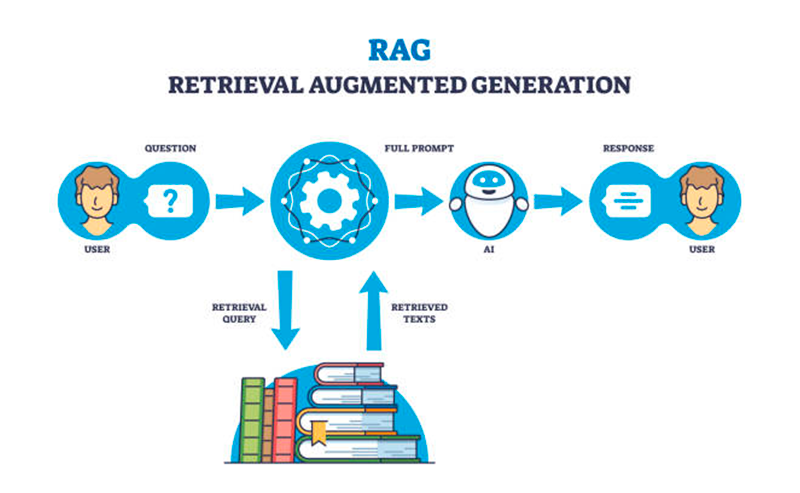

# Workshop - RAG

## O que é RAG (Retrieval-Augmented Generation)?

RAG, ou Retrieval-Augmented Generation, é uma técnica que melhora a qualidade das respostas de um modelo de IA combinando recuperação de informações (retrieval) com geração de texto (generation).

## Por que precisamos do RAG?

Os modelos de IA generativa, como o GPT-4, têm duas grandes limitações:

1. Memória limitada (context window) → Eles não podem armazenar ou acessar informações ilimitadamente.
2. Conhecimento estático → O conhecimento deles fica desatualizado após o treinamento.

Se tentarmos enviar um documento inteiro como contexto, enfrentamos custos altos e limites de tokens.

## Como o RAG resolve esse problema?

1. Indexação → Antes de responder, armazenamos documentos em um banco vetorial (FAISS, Pinecone, ChromaDB etc.).
2. Recuperação → Quando um usuário faz uma pergunta, buscamos apenas os trechos mais relevantes do documento.
3. Geração → Enviamos esses trechos para o modelo, garantindo que ele use informações corretas e atualizadas.

# Mais exemplos

## Interagindo direto com o GPT

✅ Pontos Positivos:

- Simplicidade: Fácil de entender e implementar.
- Sem dependências externas: Só precisa da biblioteca requests.
- Controle total: Você vê exatamente como a API está sendo chamada.

❌ Pontos Negativos:

- Código repetitivo: Precisa reimplementar controle de contexto e histórico.
- Difícil de escalar: Sem gerenciamento de cache ou otimizações nativas.

## Interagindo com o GPT usando Framework

✅ Pontos Positivos:

- Reutilização de código: Já vem com suporte para histórico, cache e logs.
- Facilidade de expansão: Suporte nativo para Pinecone, ChromaDB, FAISS etc.
- Melhor manutenção: Código modular e mais organizado.

❌ Pontos Negativos:

- Maior curva de aprendizado: Exige entender a estrutura do framework.
- Overhead desnecessário: Para casos simples, pode ser um exagero usar.
- Dependência de terceiros: Pode ter mudanças ou quebras inesperadas.

## Adicionando contexto em PDF

✅ Pontos Positivos:

- Implementação direta: Fácil de entender e rápido de implementar.
- Boa qualidade de resposta: O modelo recebe todas as informações relevantes.

❌ Pontos Negativos:

- Custo alto: Enviar textos grandes pode ser muito caro (tokens extras).
- Limitação da context window: Modelos têm um limite de tokens (ex: GPT-4 Turbo ~128K tokens).
- Risco de perda de informações: Se o documento for muito grande, só parte dele será processada.

## Adicionando contexto em PDF - RAG

✅ Pontos Positivos:

- Menor custo: Enviamos apenas os trechos necessários, reduzindo tokens consumidos.
- Escalabilidade: Funciona bem mesmo com documentos grandes.
- Melhora a precisão: Respostas mais contextualizadas, sem sobrecarregar a context window.

❌ Pontos Negativos:

- Mais complexo: Requer uma etapa extra de indexação e recuperação.
- Necessita banco vetorial: Precisa de FAISS, Pinecone, ChromaDB, etc.
- Qualidade depende da busca: Se a busca recuperar trechos errados, a resposta pode ser ruim.
